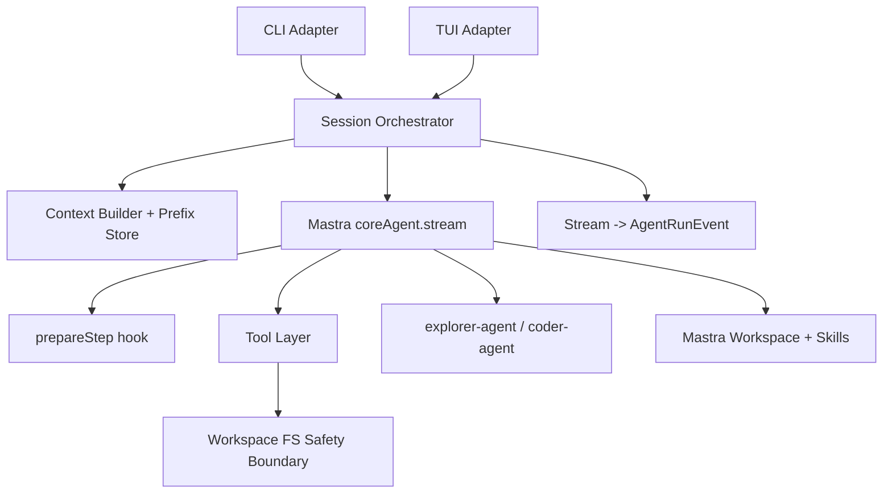
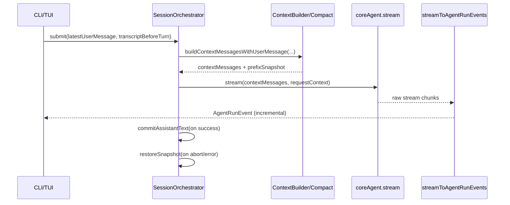

# Ole Agent Architecture Guide

## 1) Purpose

- Define a stable, implementation-oriented architecture baseline for future development.
- Keep **UI display state** and **LLM model context state** strictly separated.
- Keep Mastra integration minimal and extensible (no framework forking).

## 2) Top-Level Architecture



## 3) Layer Responsibilities

### A. Adapter Layer (CLI/TUI)

- Scope: input collection, streaming render, abort/clear controls.
- Must not own context compaction strategy or model-prefix semantics.
- Entrypoints:
  - `src/cli/cli.ts`
  - `src/cli/loop.ts`
  - `src/tui/index.ts`
  - `src/tui/store/tui-store.ts`
  - `src/tui/services/agent-turn.service.ts`

### B. Session Application Layer (single-turn orchestration)

- Scope: one-turn orchestration contract shared by CLI/TUI.
- Core responsibilities:
  - prepare turn input from transcript + latest user message
  - build compacted context when needed
  - keep request context lifecycle
  - snapshot/restore model-prefix state on abort/error
  - commit assistant output to prefix state after successful turn
- Modules:
  - `src/app/session/session-orchestrator.ts`
  - `src/app/session/context-builder.ts`
  - `src/app/session/transcript-model-prefix-store.ts`
  - `src/app/session/stream-to-events.ts`
  - `src/app/session/agent-run-event.ts`
  - `src/app/session/runtime-state.ts`

### C. Agent Runtime Layer (Mastra)

- Scope: model execution, tool calling, delegation, step policy hooks.
- Composition:
  - `src/mastra/index.ts` (Mastra instance + workspace bootstrap)
  - `src/mastra/agents/core.ts` (supervisor agent)
  - `src/mastra/agents/explorer.ts` (read-only delegated exploration)
  - `src/mastra/agents/coder.ts` (scoped delegated implementation)
  - `src/mastra/agents/compact.ts` (context summarization)
  - `src/mastra/hooks/plan-reminder.ts` (prepareStep planning reminder)

### D. Tool & Safety Layer

- Scope: deterministic side effects behind safety boundaries.
- Tool set:
  - `src/mastra/tools/bash.ts`
  - `src/mastra/tools/file-read.ts`
  - `src/mastra/tools/file-edit.ts`
  - `src/mastra/tools/file-write.ts`
  - `src/mastra/tools/todo.ts`
- Safety contracts:
  - all file IO constrained to workspace root
  - protected paths denied (`.git`, `.env*`, `node_modules`, `.ssh`)
  - symlink/binary/oversize protections
  - atomic file writes
- Implementation anchor:
  - `src/util/fs-safety.ts`

### E. Shared Infrastructure

- Config and env:
  - `src/util/env.ts`
  - `src/config/workspace-root.ts`
- Transcript type contract:
  - `src/types/message.ts`
- Skills and workspace wiring:
  - `src/mastra/workspace-factory.ts`
  - `src/util/skill-startup.ts`
  - `src/util/skill-log-format.ts`

## 4) Canonical Runtime Data Models

- `TranscriptMessage` (`user|assistant`, plain string content): canonical conversation storage and compaction input.
- `AgentRunEvent`: canonical normalized stream event contract for both CLI/TUI rendering and runtime telemetry.
- Todo runtime state: execution planning status is maintained in-memory and surfaced via events, not persisted as business state.

## 5) Single-Turn Execution Contract



## 6) Hard Architectural Invariants

1. Context compaction decision happens before `coreAgent.stream` call.
2. `SessionOrchestrator` is the only cross-adapter turn entry.
3. UI state (`blocks`, toggles, layout) never defines model-context policy.
4. Tool side effects must go through Tool Layer safety guards.
5. Subagent delegation policy is owned by `coreAgent` only.
6. No Mastra internal patching/forking; only public extension points are used.

## 7) Extension Seams (Preferred)

- Memory/knowledge integration: inject at Session Application Layer before context build, not in UI.
- Additional adapters (e.g. HTTP/API): must reuse `SessionOrchestrator` and `AgentRunEvent` pipeline.
- New tools: add under `src/mastra/tools/*`, enforce `fs-safety` and bounded outputs.
- Additional subagents: register in `coreAgent` and keep delegation policy centralized.
- Observability: consume `AgentRunEvent` stream; do not parse raw model stream in adapters.

## 8) Current Source-of-Truth Structure

```text
src/
  app/session/          # turn orchestration + context + event normalization
  mastra/               # agent runtime, subagents, hooks, tools, workspace
  cli/                  # CLI adapter
  tui/                  # TUI adapter
  util/                 # env, fs safety, context compact, skill helpers
  types/                # shared type contracts
  config/               # workspace root and bootstrap config
```

## 9) Non-Goals for This Document

- No business workflow description.
- No prompt copywriting details.
- No product/UI feature roadmap.
- No implementation TODO list unless it changes architectural boundaries.

## 10) Architecture Review Checklist

- [ ] New entrypoints (CLI/TUI/API) reuse `SessionOrchestrator` for turn execution.
- [ ] Context compaction is decided before `coreAgent.stream`, not inside UI.
- [ ] UI modules do not introduce model-context assembly or prefix-state logic.
- [ ] Stream rendering consumes normalized `AgentRunEvent`, not raw model chunks.
- [ ] New tool side effects are implemented in `src/mastra/tools/*` and pass `fs-safety` boundaries.
- [ ] File operations remain workspace-bounded, with protected paths and atomic writes preserved.
- [ ] Subagent additions are registered and governed centrally in `src/mastra/agents/core.ts`.
- [ ] `prepareStep` policy changes stay in hooks and do not leak into adapters.
- [ ] Shared type contracts (`src/types/*`, session event shapes) remain backward compatible or are migrated explicitly.
- [ ] Changes do not require Mastra internals patching/forking; only public extension points are used.
