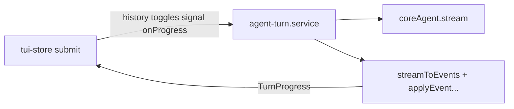

# TUI Zustand 状态：说明与演进方案

本文档描述 `src/tui/store/tui-store.ts` 的职责划分、状态域、与 Mastra 的边界，以及后续可演进方向。**实现以代码为准**；类型与动作名以 `TuiState` / `TuiActions` 为准。

## 1. 设计原则

- **单 Store**：一个 `create()` 实例（`useTuiStore`），集中管理终端 UI、转录、流式元数据与命令板。子域若继续膨胀，可再评估 `zustand/middleware` 或按域拆 store 并显式同步。
- **Mastra 在 Service 外置**：`coreAgent.stream`、流式归约（`streamToEvents` + `applyEvent` 等）放在 [`services/agent-turn.service.ts`](./services/agent-turn.service.ts)。Store 的 `submit` 只负责组装 `history`、乐观更新块、调用 `runAgentTurn`、把 `onProgress` 接到 `set`。
- **键盘路由分离**：全局键（退出、滚动、Ctrl+C、Ctrl+D、Esc 清错）在 [`hooks/useTuiKeyboard.ts`](./hooks/useTuiKeyboard.ts)；`handleKeyInput` 仅处理 Ctrl+R/T/U 与 `/` 打开命令板。

## 2. 状态域（按功能）

| 域 | 字段 | 含义 |
|----|------|------|
| 转录与滚动 | `blocks`, `scrollOffset` | 主对话块；`scrollOffset` 与 `useScrollController` 一致，为唯一下滚动来源。 |
| 流式与回合 | `isStreaming`, `debugState`, `elapsedSec` | 是否在生成；`idle` / `running` / `done` / `aborted` / `error`；本回合已跑秒。 |
| 用量与统计 | `usage`, `totalUsage`, `turnStats`, `todoStats` | 当前回合 token、累计 token、工具调用数、待办统计。 |
| 显示开关 | `toggles` | `reason` / `toolCall` / `usage`，默认对齐 `Envs`（CLI_*）。 |
| 布局 | `cols`, `rows` | 由 `useTuiTerminalSize` 写入。 |
| 命令板 | `paletteOpen`, `commands` | 命令板开关与可注册项。 |
| 输入与错误 | `query`, `globalError` | 输入框受控与全局错误条（TUI 展示 + Esc 清除，新 `submit` 时清空）。 |

`TranscriptBlock` 与 `UiEvent` 等见 [`store/types.ts`](./store/types.ts)。

## 3. 动作（Actions）

| 动作 | 作用 |
|------|------|
| `setQuery` / `setScrollOffset` / `setTerminalSize` | 布局与输入。 |
| `setPaletteOpen`, `registerCommand`, `unregisterCommand` | 命令板。 |
| `setToggles` | 流式展示开关。 |
| `setGlobalError` | 由 legacy Error 边界或扩展点写入；UI 可展示。 |
| `handleKeyInput` | 仅与 toggle / 命令板相关的键（见上）。 |
| `submit` | 校验、写用户块、调用 `runAgentTurn`、`onProgress` → `set`。 |
| `abort` | 中止当前 `AbortController` 并置 `aborted`；具体快照由 service 的 `onProgress` 再收敛。 |
| `clear` | 清空转录与部分统计。 |

## 4. 与 Mastra 的边界

- **Store**：不 import `mastra` 或 `coreAgent`；不直接操作 `stream-processors` 的流式循环。
- **Service**：`resetIdCounter` 在每轮 `runAgentTurn` 开始调用；`isAbortError` 见 [`services/abort-error.ts`](./services/abort-error.ts)。

## 5. 预置的 selector 导出

`useBlocks`, `useIsStreaming` 等在 `tui-store.ts` 底部导出，便于子组件细粒度订阅；`TuiApp` 也常用内联 `useTuiStore((s) => …)`。

## 6. 后续演进（非必须）

- 将 `onProgress` 的 payload 收敛为更窄的 DTO，避免与 `TuiState` 字段名重复。
- 若「会话」与「纯 UI」差异变大：拆 `useSessionStore` + `useUiStore` 或上 persist 层。
- 命令板内可输入过滤时，在 `useTuiKeyboard` 中增加 `paletteOpen` 下的局部焦点，避免吞键与主输入冲突。
